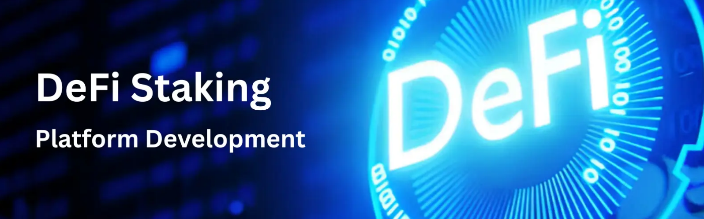

A public staking web platform where users can stake their tokens to earn rewards. This project is designed for demonstration purposes and serves as a reference for other developers interested in our staking mechanisms.

 

 

## Features

- **Stake Tokens**: Users can stake tokens to participate in the staking rewards program.
- **Earn Rewards**: Rewards are distributed based on the amount and duration of the staked tokens.
- **Airdrop Mechanism**: Users can earn free tokens based on engagement and referrals, increasing adoption.
- **Dynamic Presale Model**: A smart contract-driven presale ensures transparent and fair distribution before the project launch.
- **Enhancing Staking with Utility**: Stakers can earn passive income while unlocking exclusive platform benefits.

## Installation

Clone the repository:

 git clone [repo-url]

Install package:

 npm install
 
Start project:

 npm run dev or npm start

## Tech

- **React/Next**: For building the user interface.
- **Web3**: For interacting with the Ethereum blockchain.
- **Solidity**: For smart contract development.
- **Node.js**: For the backend server.

## License
    This project is licensed under the MIT License - see the LICENSE file for details.